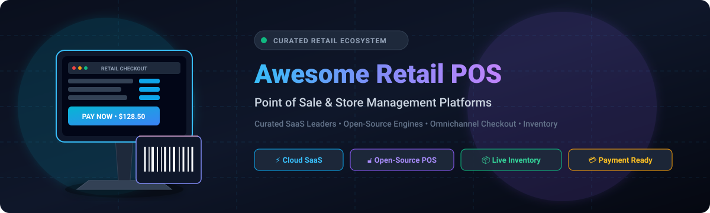

<div align="center">



# 🛍️ Awesome Retail Point of Sale (POS)

**A Curated Directory of Enterprise SaaS Solutions & Open-Source Retail POS Systems**  
*Comprehensive guide for in-store checkout, real-time inventory management, payment processing, omnichannel commerce, and store operations.*

<br/>

<p align="center">
  <a href="https://github.com/ishandutta2007/Awesome-Awesome-Awesome"></a>
  <a href="https://discord.gg/jc4xtF58Ve"></a>
  <a href="https://github.com/ishandutta2007/Awesome-Retail-Point-Of-Sale/stargazers"></a>
  <a href="https://github.com/ishandutta2007/Awesome-Retail-Point-Of-Sale/network/members"></a>
  <a href="https://github.com/ishandutta2007/Awesome-Retail-Point-Of-Sale/issues"></a>
  <a href="https://github.com/ishandutta2007/Awesome-Retail-Point-Of-Sale/blob/main/LICENSE"></a>
  <a href="https://github.com/ishandutta2007"></a>
</p>

---

</div>

## 📌 Table of Contents
- [📖 Overview & SEO Guide](#-overview--seo-guide)
- [☁️ SaaS / Commercial POS Platforms](#-saas--commercial-pos-platforms)
- [🔓 Open-Source GitHub Projects](#-open-source-github-projects)
- [🏗️ Self-Hosted Architecture & Building Blocks](#-self-hosted-architecture--building-blocks)
- [🤝 How to Contribute](#-how-to-contribute)
- [📈 Star History](#-star-history)
- [⚖️ Disclaimer & Security](#-disclaimer--security)

---

## 📖 Overview & SEO Guide

The **Retail Point of Sale (POS)** ecosystem is the operational backbone of modern physical and hybrid commerce. A modern retail POS platform coordinates:
- 💳 **Cashier Checkout & Payment Processing**: Contactless NFC (Apple Pay, Google Pay), chip cards, gift cards, split payments, and cash drawer management.
- 📦 **Inventory & Stock Management**: Multi-location stock synchronisation, purchase orders, automated low-stock reordering, barcode/SKU scanning, and supplier catalogs.
- 🌐 **Omnichannel Commerce**: Real-time unified catalog linking online stores (Shopify, WooCommerce, Magento) with brick-and-mortar storefronts (BOPIS / Click-and-Collect).
- 👥 **Customer Loyalty & Staff Management**: Role-based permissions, shift tracking, commission reporting, CRM profiles, and reward points.

---

## ☁️ SaaS / Commercial POS Platforms

> **📊 Sector Market Size & Competitive Dynamics**:  
> The global Retail Point of Sale (POS) market is estimated at **$38.5 Billion to $43.3 Billion** (projected to reach over **$80+ Billion by 2030** at a CAGR of ~12–14%). The sector is **highly fragmented** rather than a winner-take-all monopoly; diversified multinational payment conglomerates compete alongside specialized vertical SaaS platforms and regional processors catering to distinct retail niches and fiscal regulatory environments.

Below is the comparative breakdown of premier SaaS POS platforms, sorted in descending order of company size (valuation / market capitalization / revenue):

| Platform | Company Size / Valuation | Description | Starting Tier Pricing | Free Tier / Free Trial Limits |
| :--- | :--- | :--- | :--- | :--- |
| 🛍️ **[Shopify POS](https://www.shopify.com/pos)** | **~$100B+ Market Cap** (NYSE: SHOP)<br/>*Annual Revenue: ~$7.1B+* | Omnichannel POS seamlessly unified with Shopify ecommerce; ideal for merchants operating both digital storefronts and brick-and-mortar locations. | Starts at **$39/mo** (Shopify Basic plan including POS Lite) / POS Pro add-on is **$89/mo** per location | **3-day free trial** (unlimited access to back-office setup, product catalog, and hardware config; live payment checkout disabled until a paid subscription is chosen) |
| 🍀 **[Clover](https://www.clover.com/)** | **~$90B+ Parent Cap** (Fiserv - NYSE: FI)<br/>*Annual Revenue: ~$19.3B (processes $270B+ GPV)* | Extensively deployed modular POS ecosystem pairing proprietary touch terminals with a rich app marketplace. | Starts at **$14.95/mo** (Starter / Payments Plus software) up to **$49.95–$89/mo** (Standard / Retail plans) + hardware | **90-day free trial** on select software tiers (Clover Essentials / Services Growth; subject to merchant credit approval, 1 trial per business tax ID) |
| 🟦 **[Square POS / Square for Retail](https://squareup.com/us/en/point-of-sale)** | **~$42B+ Market Cap** (Block - NYSE: SQ)<br/>*Annual Revenue: ~$21.9B* | Intuitive, hardware-versatile POS solution designed for rapid deployment, micro-merchants, and scaling retail boutiques. | **$0/mo** (Free plan, transaction rate 2.6% + 15¢ in-person); Retail Plus starts at **$89/mo** per location | **Free forever plan** (1 physical location, standard barcode scanning & customer directory; iOS-only for Retail Free interface; excludes purchase orders and advanced profit reporting) |
| ❤️ **[Heartland Retail](https://www.heartlandpaymentsystems.com/)** | **~$28B+ Parent Cap** (Global Payments - NYSE: GPN)<br/>*Annual Revenue: ~$9.7B* | Enterprise cloud retail POS and payment processing platform crafted for multi-unit retailers and specialty franchises. | Starts at **$89/mo** per selling station (plus standard implementation setup) | **14-day free trial** (available via authorized partner/demo registration; full software evaluation of multi-store station features) |
| ⚡ **[Revel Systems](https://revelsystems.com/)** | **~$7.5B Parent Cap** (Shift4 - NYSE: FOUR)<br/>*Acquired for $250M; Shift4 Rev: ~$3.1B* | High-capacity iPad-based POS and store management system built for high-throughput retail and hybrid quick-service setups. | Starts at **$99/mo** per terminal (billed annually, 2-terminal minimum requirement with a 3-year processing agreement) | **No free tier** (guided live demo provided by sales; a 60-day trial is offered exclusively for the Revel+ managed services add-on) |
| 💡 **[Lightspeed Retail](https://www.lightspeedhq.com/retail/)** | **~$2.2B Market Cap** (NYSE: LSPD)<br/>*Annual Revenue: ~$910M* | Advanced specialty retail POS (incorporating Vend) featuring robust multi-location inventory, purchase orders, and supplier workflows. | Starts at **$89/mo** (Basic plan billed annually with Lightspeed Payments) or **$109/mo** (billed monthly) | **14-day free trial** (unrestricted access to cloud POS back-office, catalog imports, and inventory matrices; no credit card required) |
| 🇬🇧 **[EPOS Now](https://www.eposnow.com/)** | **~$400M Valuation** (Private)<br/>*Annual Revenue: ~$70M+ ARR* | Cloud-based point of sale and business intelligence software serving small to mid-sized retailers across Europe and North America. | Starts at **$39/mo** per terminal (Standard cloud software license) | **30-day free trial** (complete trial access to cloud POS register, reporting analytics, and inventory dashboard) |
| 🏢 **[ERPLY](https://erply.com/)** | **~$120M Valuation** (Private)<br/>*Annual Revenue: ~$30M ARR* | Scalable cloud ERP and POS platform built for multi-store retail chains demanding centralized real-time stock visibility. | Starts at **$59/mo** (Standard Retail tier per location) | **60-day free trial** (unlimited evaluation of cloud POS and warehouse inventory tools, no credit card required) |
| 🎯 **[KORONA POS](https://koronapos.com/)** | **~$40M Valuation** (COMBASE USA - Private)<br/>*Annual Revenue: ~$12M ARR* | Processing-agnostic cloud POS tailored for specialty retail, convenience stores, ticketing, and high-risk merchants. | Starts at **$59/mo** per terminal (Core plan, flat-rate monthly, processor freedom) | **Unlimited free trial** (no time expiration on sandbox testing for back-office and register layout; live production processing disabled until activation) |

---

## 🔓 Open-Source GitHub Projects

Open-source POS solutions give retailers full ownership of their data, eliminate recurring software subscription fees, and enable complete customisation of checkout flows. 

The repositories below are **sorted in descending order of GitHub star count**:

1. **[Odoo (Point of Sale Module)](https://github.com/odoo/odoo)** [](https://github.com/odoo/odoo/stargazers)  
   🏆 Complete open-source enterprise suite featuring an integrated web POS with offline transaction caching, touchscreen UI, barcode scanner support, and native syncing with accounting and warehouse stock.

2. **[ERPNext](https://github.com/frappe/erpnext)** [](https://github.com/frappe/erpnext/stargazers)  
   📦 100% open-source Python/JS ERP that includes a production-ready Point of Sale module with multi-currency pricing, loyalty points, serialized inventory, and automated sales invoicing.

3. **[Open Source Point of Sale (OSPOS)](https://github.com/opensourcepos/opensourcepos)** [](https://github.com/opensourcepos/opensourcepos/stargazers)  
   🏪 Battle-tested PHP/CodeIgniter & MariaDB web-based POS system designed for small and independent retail stores, featuring barcode printing, tax calculations, and cash register auditing.

4. **[NexoPOS](https://github.com/Blair2004/NexoPOS)** [](https://github.com/Blair2004/NexoPOS/stargazers)  
   ⚡ Modern, customizable POS and store management application built with Laravel, Vue.js, and Tailwind CSS; supports multi-store operations, cash registers, and modular extensions.

5. **[Store-POS](https://github.com/tngoman/Store-POS)** [](https://github.com/tngoman/Store-POS/stargazers)  
   💻 Offline-capable desktop POS application crafted with Electron, React, and SQLite; supports multi-terminal local area networks (LAN), visual product catalogs, and barcode scanning.

6. **[Lakasir](https://github.com/lakasir/lakasir)** [](https://github.com/lakasir/lakasir/stargazers)  
   🧾 Lightweight, open-source web POS application built with PHP/Laravel designed for small retail shops and micro-merchants seeking fast checkout and ledger accounting.

7. **[Apache OFBiz](https://github.com/apache/ofbiz)** [](https://github.com/apache/ofbiz/stargazers)  
   🏛️ Industrial-grade Java enterprise automation software suite with integrated retail Point of Sale, comprehensive supply chain management, and omnichannel order orchestration.

8. **[TailPOS](https://github.com/bailabs/tailpos)** [](https://github.com/bailabs/tailpos/stargazers)  
   📱 Offline-first mobile and tablet POS application built with React Native that seamlessly synchronizes with ERPNext backends for retail catalog and transaction processing.

9. **[URY](https://github.com/ury-erp/ury)** [](https://github.com/ury-erp/ury/stargazers)  
   🍽️ Specialized ERPNext-based retail and restaurant management framework featuring fast cashier ordering, table mapping, kitchen display systems, and inventory tracking.

10. **[MyCompany](https://github.com/lsfusion-solutions/mycompany)** [](https://github.com/lsfusion-solutions/mycompany/stargazers)  
    📊 Self-hosted ERP and retail POS platform built on the lsFusion platform for small-to-medium retail businesses, featuring product matrixes, invoicing, and warehouse management.

11. **[KLiK PoS](https://github.com/Beveren-Software-Inc/KLiK_PoS)** [](https://github.com/Beveren-Software-Inc/KLiK_PoS/stargazers)  
    🚀 Sleek, responsive touch-optimized Point of Sale frontend for ERPNext, tailored for rapid item lookup, customer management, and receipt printing.

12. **[antPOS](https://github.com/anthertech/antPOS)** [](https://github.com/anthertech/antPOS/stargazers)  
    🐜 Fast, lightweight Vue.js Point of Sale interface designed to run on top of Frappe / ERPNext with keyboard shortcuts and instant sales invoice generation.

---

## 🏗️ Self-Hosted Architecture & Building Blocks

For developers and retail technologists looking to build an independent store stack:

```
┌─────────────────────────────────────────────────────────────┐
│                 In-Store Cashier Interface                  │
│    (Touchscreen / iPad / PWA / Electron / Barcode Reader)   │
└──────────────────────────────┬──────────────────────────────┘
                               │ Local LAN / WebSocket / REST
┌──────────────────────────────▼──────────────────────────────┐
│                    Open-Source POS Engine                   │
│        (Odoo POS / ERPNext / OSPOS / NexoPOS / Store-POS)   │
├──────────────────────────────┬──────────────────────────────┤
│ 📦 Central Inventory & Stock │ 💳 Payment Terminal Gateway  │
│ 👥 Customer CRM & Loyalty    │ 🧾 ESC/POS Thermal Printing  │
│ 📊 Sales Analytics & Tax     │ 🌐 Omnichannel Sync (eCom)   │
└──────────────────────────────┴──────────────────────────────┘
```

- 🖨️ **Thermal Receipt Printing**: Utilize standard ESC/POS protocol drivers over USB, Bluetooth, or LAN.
- 💳 **Payment Integration**: Connect physical smart terminals via Stripe Terminal, Square Reader SDK, or local payment provider APIs.
- 📡 **Offline Resilience**: Progressive Web Apps (PWAs) and local SQLite/IndexedDB caching allow checkout to continue during network outages.

---

## 🤝 How to Contribute

We welcome contributions from retail developers, store operators, and open-source contributors!

1. 🍴 Fork the repository.
2. 🌿 Create a new feature branch (`git checkout -b feature/add-pos-platform`).
3. 📝 Add or update entries in [README.md](README.md) following the existing table and list formats.
4. ✨ Ensure descriptions are factual, pricing details are verified, and star badges follow the standard format.
5. 🚀 Submit a Pull Request with a descriptive summary of your changes.

⭐ **Don't forget to star the repository if you find it helpful!**

---

## 📈 Star History

[](https://star-history.dera.page/#ishandutta2007/Awesome-Retail-Point-Of-Sale&type=date&legend=top-left)

---

## ⚖️ Disclaimer & Security

- 🔒 **Data & Compliance**: Point of Sale systems process sensitive payment and customer data. Ensure compliance with PCI-DSS guidelines, local fiscalization laws, and secure network segmentation.
- 📑 **Independent Curation**: This repository is a community-maintained curated index. Pricing and terms are subject to change by respective software providers.

---

<div align="center">
  <b>Built for merchants, developers, and retail technologists striving for open, sovereign, and scalable checkout stacks.</b>
</div>

